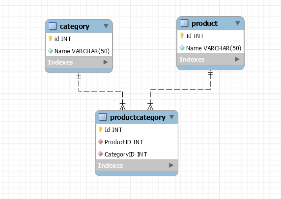

# Задание
## В базе данных MS SQL Server есть продукты и категории. Одному продукту может соответствовать много категорий, в одной категории может быть много продуктов. Напишите SQL запросс для выбора всех пар "Имя продукта - Имя категории". Если у продукта нет категории, то его имя все равно должно выводиться.

